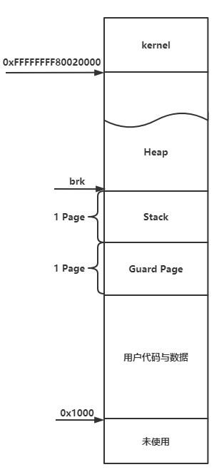
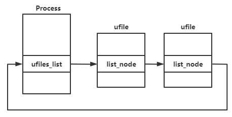
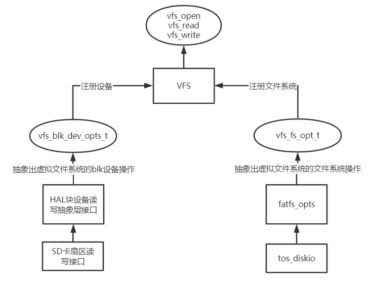

# LinanOS 消失的发际线/上海海洋大学

LinanOS是本次比赛实现的一个能够运行在K210 RISC-V 64位处理器的操作系统，主要使用C语言以及少量的汇编代码编写。

编写LinanOS在完成比赛的同时能够学习到更多操作系统的知识，进一步提高自己，全部代码由@[CalvinXu](https://github.com/CalvinXu17)完成。

## 已实现的功能

- [x] 中断、异常处理
- [x] k210 SD卡驱动
- [x] 分页机制、First-Fit页面管理
- [x] Slob内存分配
- [x] 进程控制、进程调度
- [x] FAT32文件系统及VFS虚拟文件系统
- [x] 运行ELF可执行文件
- [x] 实现一组基础的系统调用
- [x] 支持控制台串口输入、输出

## TODO

- [ ] 中断嵌套的实现
- [ ] 更高效的内存管理
- [ ] 缺页异常的完整处理
- [ ] 调度器的优化
- [ ] 完善VFS结构、实现Link等操作
- [ ] 线程的实现
- [ ] 系统调用的完善
- [ ] 设备管理
- [ ] 实现在qemu运行
## 目录结构

- **build**
  
  build目录生成编译产生的文件以及最终链接成的系统镜像

- **doc**
  
  文档相关文件的目录
  
- **os**
  
  os目录内为系统的源代码，该目录下有driver（k210 sd卡驱动）、fatfs（fat文件系统）、hal（blk设备扇区读写硬件抽象层兼容接口）、kernel（系统核心模块）、lib（部分库函数实现）、user（用户态软件）、vfs（虚拟文件系统）

- **sbi**

  sbi目录存放由rustsbi改编后编译成的sbi引导，分为k210与qemu两个版本

## boot相关

- **rustsbi**

系统引导部分采用rustsbi，由于k210不支持将外部中断代理到S态，因此rustsbi通过S态ecall注册函数的方式实现在M态执行内核代码处理外部中断，但在开启分页后该功能出现异常，LinanOS使用[HUST-OS/xv6-k210: Port XV6 to K210 board! (github.com)](https://github.com/HUST-OS/xv6-k210)改编后的rustsbi，将外部中断代理到**S态软中断**进行处理。

- **hartid获取**

由于S态无法获取到mhardid寄存器的值，因此在boot中采用软获取的方式设置hartid：

```assembly
k_entry: # 0x80020000
    la a0, boot_hartid
    li a1, 1
    amoadd.w a0, a1, (a0) # t=(a0),(a0)=t+a1,a0=t 通过原子操作软获取hartid存至a0
```

通过**amoadd.w**原子操作从指定内存中取值后再将内存中的值加1，第一个执行的CPU Core取到0，第二个CPU Core取到1，存入a0寄存器中作为系统初始化的参数之一。

## 中断与异常处理

1. LinanOS暂不支持中断嵌套，中断与异常处理期间该CPU Core将屏蔽所有中断
2. 中断与异常发生时将进入trap中进行处理，trap程序为os/kernel/intr.S中的代码，保存CPU的上下文环境，然后跳往中断与异常处理程序处理相应的中断与异常。
3. LinanOS中的每个进程都有一个保存进入trap之前上下文的结构体```trap_context```该结构体保存在进程的**PCB**中，```trap_context```保存了所有寄存器的信息，其地址存放在**sscratch**寄存器中，中断和异常发生时从**sscratch**寄存器中取出该结构体地址，保存CPU上下文环境到结构体中，中断与异常处理完毕后再从中恢复CPU上下文。

## 进程管理相关

LinanOS中进程PCB为```Process```结构体，保存进程的必要信息，结构如下：

```c
struct Process
{
    uint64 *k_stack; // 内核栈
    uint64 *pg_t; // 页表
    struct trap_context tcontext; // 保存中断异常发生时的上下文
    struct proc_context pcontext; // 内核线程上下文
    int32 pid;      // 进程id
    int32 status; 	// 进程此时的状态
    int64 t_wait;   // 进程休眠时间
    int64 t_slice; 	// 进程时间片
    char code;      // 保存进程exit的代码
    struct semephore signal; // 父子进程通讯信号量
    struct Process *parent;  // 父进程
    list status_list_node;   // 就绪队列、等待队列等队列链接指针
    list child_list_node;    // 子进程队列
    list child_list;         // 用于链接到父进程子进程队列
    void *data;	             // 暂存数据，用于存放信号量信息
    spinlock lock;	         // 进程锁
    uint64 start_time;       // 进程开始执行时的时间
    uint64 end_time;         // 进程终止时的时间
    uint64 utime_start;      // 用户态代码开始执行的时间
    uint64 stime_start;      // 内核态代码开始执行的时间
    uint64 utime;            // 用户态执行的时间
    uint64 stime;            // 内核态执行的时间
    vfs_dir_t *cwd;	         // 当前目录
    list ufiles_list;        // 文件链表
    void *minbrk;            // brk最小值
    void *brk;               // brk指针
};
```

每一个进程都有一个独立的内核栈，用于进程通过系统调用进入S态执行内核空间的代码时使用，进程切换发生在内核空间中，发生切换时需要将**sscratch**置为新进程```trap_context```的地址，同时要更新页表寄存器，然后保存内核线程上下文环境到进程PCB中的```proc_context```中并切换到新进程的内核线程上下文环境，```proc_contex```与```trap_context```类似只不过其只包含了当前内核线程的callee-saved寄存器信息，```proc_context```定义如下：

```c
struct proc_context
{
    uint64 ra;
    uint64 sp;
  // callee-saved
    uint64 s0;
    uint64 s1;
    uint64 s2;
    uint64 s3;
    uint64 s4;
    uint64 s5;
    uint64 s6;
    uint64 s7;
    uint64 s8;
    uint64 s9;
    uint64 s10;
    uint64 s11;
};
```

由于LinanOS不支持中断嵌套，因此处于内核态无法响应中断，由于调度程序运行在内核态中，为了防止在无进程可执行时CPU卡死在调度程序中无法切换出去，LinanOS默认初始化一个内核级的**0号进程**，无进程可执行时将处于0号进程中，此时中断被打开CPU可以响应中断而不会卡死在调度中。

以下为进程管理相关系统调用的实现思路详述：

| 序号 | 系统调用名称         | 系统调用号 | 评测机通过 | 存在的问题       |
| ---- | ---------------------- | ------ | -------- | -------------------------- |
| 1    | SYS_clone | 220  | 是       |ptid、tls、ctid参数暂未处理|
| 2 | SYS_execve | 221 | 是 |envp环境变量指针使用方法不明|
| 3 | SYS_wait4 | 260 | 是 |只处理了WNOHANG与NULL两种options参数|
| 4 | SYS_exit | 93 | 是 ||
| 5 | SYS_getppid | 173 | 是 ||
| 6 | SYS_getpid | 172 | 是 ||

### 1. #define SYS_clone 220

- 功能：创建一个子进程；

- 输入：

  - flags: 创建的标志，如SIGCHLD；
  - stack: 指定新进程的栈，可为0；
  - ptid: 父线程ID；
  - tls: TLS线程本地存储描述符；
  - ctid: 子线程ID；

- 返回值：成功则返回子进程的线程ID，失败返回-1；

#### 1.1 实现思路与核心代码

SYS_clone为复制出一个子进程，这里没有采用Linux的写时复制技术，而是直接复制父进程的内存。

```c
struct Process *child = new_proc();
child->parent = parent;
memcpy(&child->tcontext, &parent->tcontext, sizeof(struct trap_context));
child->tcontext.k_sp = (uint64)(child->k_stack) + PAGE_SIZE;
child->tcontext.sepc += 4; // 子进程pc+4执行ecall下一条指令
child->pcontext.ra = (uint64)trap_ret; // 子进程从trap_ret开始执行从内核态转换为用户态
if(stack)
	child->tcontext.sp = stack;
```

1. new出一个新的子进程。
2. 设置好子进程的父进程指针。
3. 拷贝父进程```trap_context```的信息到子进程中
4. 设置子进程的内核栈。
5. sepc=sepc+4，异常返回后执行触发异常的ecall指令的下一条指令。
6. 设置子进程内核线程上下文```proc_context```的ra寄存器的值，在完成上下文切换后会执行ret指令返回到ra寄存器的地址，这里ra寄存器设置为```trap_ret```，其实现在**intr.S**中，用于在trap返回时恢复```trap_context```中保存的用户态上下文环境，然后执行**sret**指令返回到用户态程序，这样就实现了进程的切换
7. 初始化子进程的页表，然后将父进程的内存复制到子进程中，具体操作就是页面的拷贝，通过循环遍历页表来实现，由于代码较长，这里不贴出具体的实现。
8. 如果指定了用户栈的地址，则要设置```trap_context```中的sp，否则默认与父进程一致。
9. 通过如下代码实现文件的复制，0号与1号文件分别为**stdin**和**stdout**其在```new_proc()```函数中已经创建好，复制父进程中的**pipe**文件到子进程实现父子进程的管道通讯。

```c
list *l = parent->ufiles_list.next;
while(l != &parent->ufiles_list)
{
    ufile_t *file = list2ufile(l);
    l = l->next;
    if(file->type == UTYPE_PIPEIN)
    {
        ufile_t *cfile = ufile_alloc_by_fd(file->ufd, child);
        if(cfile)
        {
            cfile->type = UTYPE_PIPEIN;
            cfile->private = file->private;
            pipe_t *pipin = cfile->private;
            lock(&pipin->mutex);
            pipin->r_ref++;
            unlock(&pipin->mutex);
        }
    } else if(file->type == UTYPE_PIPEOUT)
    {
        ufile_t *cfile = ufile_alloc_by_fd(file->ufd, child);
        if(cfile)
        {
            cfile->type = UTYPE_PIPEOUT;
            cfile->private = file->private;
            pipe_t *pipin = cfile->private;
            lock(&pipin->mutex);
            pipin->w_ref++;
            unlock(&pipin->mutex);
        }
    }
}
```

9. 最后将子进程加入到```ready_list```就绪队列中等待被调度。

#### 1.2 存在的问题

由于线程未实现，一个进程相当于只有一个线程，因此ptid、tls、ctid参数未实现

### 2. #define SYS_execve 221

- 功能：执行一个指定的程序；
- 输入：
  - path: 待执行程序路径名称，
  - argv: 程序的参数，
  - envp: 环境变量的数组指针
- 返回值：成功不返回，失败返回-1；

#### 2.1 实现思路与核心代码

SYS_execve系统调用将启动指定路径的程序，若创建成功则会执行新的程序，原调用程序不会返回而是执行新的进程，看起来就像是被新的进程所替代了，若启动失败则返回-1。

```c
struct Process *cur_proc = getcpu()->cur_proc;
struct Process *new_proc = create_proc_by_elf(abspath);
if(!new_proc) return -1;
```

1. 首先根据传入的path计算出绝对地址，然后调用```process.c```中的 ```create_proc_by_elf()```从elf文件中创建进程，失败返回-1。

```c
// 切换到新进程内存空间
uint64 sapt = ((((uint64)proc->pg_t) - PV_OFFSET) >> 12) | (8L << 60);
set_satp(sapt);
sfence_vma();
for(seci=0; seci < ehdr.phnum; seci++) // 遍历elf文件段表
{
    struct proghdr *sec = &phdr[seci];
    uint64 vaddr = sec->vaddr;
    uint64 file_offset = sec->off;
    uint64 file_size = sec->filesz;
    uint64 vpagestart = (vaddr >> 12) << 12;
    uint64 page_cnt = getpagecnt(vaddr + sec->memsz - vpagestart);

    void *mem = build_pgt(proc->pg_t, vpagestart, page_cnt); // 分配页面并设置页表
    if(!mem)
    {
        #ifdef _DEBUG
        printk("read section table error\n");
        #endif
        kfree(phdr);
        free_process_mem(proc);
        free_process_struct(proc);
        return NULL;
    }
    sfence_vma(); // 刷新页表寄存器
    vfs_lseek(fd, file_offset, VFS_SEEK_SET);
    uint64 ss = vfs_read(fd, vaddr, file_size); // 读取进程数据到指定内存
    if(vpagestart + page_cnt * PAGE_SIZE> secaddrmin)
        secaddrmin = vpagestart + page_cnt * PAGE_SIZE; // 保存最高的段地址后面用来初始化brk
}
kfree(phdr);
````

2. ```create_proc_by_elf()```函数将读取指定路径中的文件信息，根据elf文件头以及段表中的信息给进程分配页面并设置页表，上述代码为复制文件中进程数据到指定内存中的核心代码，首先将页表寄存器切换到新的进程然后遍历elf文件段表并从文件中拷贝至内存。
3. 将argc与argv写入用户栈中，并设置sp指向argc（此处注意内存对齐）
4. 到这里说明新进程已经创建成功，接着将原进程的数据释放，并将PCB中的数据替换为新进程的PCB数据，这里注意pid、内核栈等信息是不变的。
5. 将**sscratch**置为新进程的```trap_context```并设置页表寄存器为新进程的页表，接着直接执行```trap_ret()```返回用户程序执行。
6. LinanOS**用户进程内存空间分布**如下图所示：



#### 2.2 存在的问题

系统未实现环境变量，envp: 环境变量的数组指针未作处理。

### 3. #define SYS_wait4 260

- 功能：等待进程改变状态;
- 输入：
  - pid: 指定进程ID，可为-1等待任何子进程；
  - status: 接收状态的指针；
  - options: 选项：WNOHANG，WUNTRACED，WCONTINUED；
- 返回值：成功则返回进程ID；如果指定了WNOHANG，且进程还未改变状态，直接返回0；失败则返回-1；

#### 3.1 实现思路与核心代码

SYS_wait4等待子进程改变状态，该调用分支较多，pid=-1时等待任意子进程，否则等待指定的子进程，options=WNOHANG等待时将阻塞，否则不阻塞。

1. 非阻塞：遍历子进程链表并根据status判断其状态，找到退出的子进程则**释放子进程PCB**并返回子进程pid，否则直接返回0
2. 阻塞：如下代码所示，首先P操作信号量，若信号量有值则存在子进程退出并向其发信号，则继续执行遍历子进程链表的操作找出退出的子进程**释放子进程PCB**，否则P操作失败会将该进程切换并加入到```sleep_list```中。

```c
while(1)
{
    P(&proc->signal); // 阻塞
    lock(&proc->lock);
    l = proc->child_list.next;
    while(l != &proc->child_list)
    {
        p = child_list_node2proc(l);
        if(p->status == PROC_DEAD)
        {
            del_list(&p->child_list_node);
            del_list(&p->status_list_node); // 摘除
            if(code)
            {
                uint32 ccode = p->code;
                ccode = ccode << 8;
                *code = ccode;
            }
            pid = p->pid;
            // 释放进程结构体
            free_process_struct(p);
            unlock(&proc->lock);
            return pid;
        }
        l = l->next;
    }
    unlock(&proc->lock);
}
```

#### 3.2 存在的问题

只处理了进程exit时通知父进程，未处理进程向其他状态的改变。

### 4. #define SYS_exit 93

- 功能：触发进程终止，无返回值；
- 输入：终止状态值；
- 返回值：无返回值；

#### 4.1 实现思路与核心代码

仿照Linux exit的实现思路，LinanOS退出时只释放进程内存而**不释放进程PCB**，进程的PCB由父进程退出时或者主动调用**SYS_wait4**时释放，因此在exit时需要遍历子进程链表并释为```PROC_DEAD```终止态的子进程PCB。

```c
struct Process *proc = getcpu()->cur_proc;
lock(&proc->lock);
proc->status = PROC_DEAD; // 置状态位为DEAD
proc->end_time = get_time();
proc->code = code;
struct Process *parent = proc->parent;
lock(&parent->lock);
list *l = proc->child_list.next;
while(l!=&proc->child_list) // 将子进程加入到父进程的子进程队列中
{
    struct Process *child = child_list_node2proc(l);
    l = l->next;
    if(child->status == PROC_DEAD) // 有未释放的子进程pcb则释放，否则将子进程加入其父进程
    {
        kfree(child->k_stack);
        free_process_struct(child);
    } else add_before(&parent->child_list, &child->child_list_node);
}
unlock(&parent->lock);
free_process_mem(proc);
free_ufile_list(proc);
V(&parent->signal);
move_switch2sched(proc, &dead_list);
```

1. 置状态为```PROC_DEAD```，设置```end_time```
2. 保存 **exit code**
3. 遍历子进程链表，释放已退出的子进程PCB，未退出的子进程加入到父进程的子进程链表中
4. 释放进程内存
5. 释放打开的文件
6. 发信号通知父进程
7. 切换到调度程序

#### 4.2 存在的问题

无

### 5. #define SYS_getppid 173

- 功能：获取父进程ID；
- 输入：系统调用ID；
- 返回值：成功返回父进程ID；

#### 5.1 实现思路与核心代码

获取父进程的pid，直接从当前进程PCB中取出parent指针，再取出parent->pid并返回

#### 5.2 存在的问题

无

### 6. #define SYS_getpid 172

- 功能：获取进程ID；
- 输入：系统调用ID；
- 返回值：成功返回进程ID；

#### 6.1 实现思路与核心代码

获取当前进程pid，直接从当前进程PCB中取出pid并返回

#### 6.2 存在的问题

无

## 文件系统相关

由于初赛时间有限，FAT32文件系统从[TencentOS-tiny/components/fs/fatfs at master · Tencent/TencentOS-tiny (github.com)](https://github.com/Tencent/TencentOS-tiny/tree/master/components/fs/fatfs)中移植过来并做了一定的修改完善其功能并解决了几个BUG，同时在FAT32文件系统基础上进一步完善VFS虚拟文件系统，适配比赛要求的文件系统相关的系统调用接口。

起初在设计文件系统时未考虑到不同进程fd文件描述符彼此隔离，所有文件描述符fd均为同一个文件数组的下标，且当时未充分考虑到0号与1号文件为终端的IO，也未考虑到Pipe管道IO文件，因此VFS未能适配这几种情况，由于时间紧迫未能来得及修改和完善VFS。后面为了兼容系统调用接口同时隔离不同进程的fd，又抽象了一层**ufile**文件，**进程PCB**中存放的**文件链表**即为ufile，如下图所示：



ufile对不同类型的文件做了区分，并且拥有一个独立的ufd文件描述符，系统调用返回用户的fd即为ufile中的ufd。ufile结构体如下：

```c
typedef struct ufile {
    ufile_type_t type;
    int ufd;
    void *private;
    list list_node;
} ufile_t;
```

其中```ufd```在进程的```ufiles_list```是**按序递增**的，这样在分配ufd时将线性扫描链表，找出未分配的最小的ufd，同时也可以使用```ufile_alloc_by_fd()```指定ufd进行分配。

在文件读写时，根据ufile中的```type```区分不同的文件类型，执行不同的读写操作，private指针保存不同类型文件的数据，若为vfs文件则保存fd，若为Pipe文件则保存```pipe_t```的指针，文件类型如下：

```c
typedef enum ufile_type {
    UTYPE_STDIN,
    UTYPE_STDOUT,
    UTYPE_PIPEIN,
    UTYPE_PIPEOUT,
    UTYPE_LINK,
    UTYPE_FILE,
    UTYPE_DIR,
} ufile_type_t;
```

其中```UTYPE_LINK```文件链接暂未实现，```UTYPE_FILE```与```UTYPE_DIR```由虚拟文件系统调用底层FAT32FS实现。由于VFS实现的不完善为了系统调用的兼容使得代码增加了一层ufile，后续工作将会改进VFS来去掉ufile层来优化文件系统的代码。

VFS虚拟文件系统使用底层SD卡抽象出的设备读写操作与FAT32文件系统抽象出的文件系统操作，将设备与文件系统注册关联后使用对应用层提供统一的调用接口进行操作，实现架构图如下所示：



以下为文件系统相关系统调用的实现思路详述：


| 序号 | 系统调用名称         | 系统调用号 | 评测机通过 | 存在的问题       |
| ---- | ---------------------- | ------ | -------- | -------------------------- |
| 1    | SYS_getcwd     | 17     | 是       |                            |
| 2    | SYS_pipe2      | 59     | 是       |                            |
| 3    | SYS_dup        | 23     |  是        |                            |
| 4    | SYS_dup3       | 24     |    是      |                            |
| 5    | SYS_chdir      | 49     | 是       |                            |
| 6    | SYS_openat     | 56     | 是       | mode未实现              |
| 7    | SYS_close      | 57     | 是       |                            |
| 8    | SYS_getdents64 | 61     | 是       | d_ino直接置为了vfs中inode的地址 |
| 9    | SYS_read       | 63     | 是       |                            |
| 10   | SYS_write      | 64     | 是       |                            |
| 11 | SYS_linkat | 37 | 无评测用例 | 未实现 |
| 12 | SYS_unlinkat | 35   |  是       | 未实现文件链接的删除 |
| 13   | SYS_mkdirat    | 34         | 是         | mode未实现 |
| 14   | SYS_mount      | 40         | 是 | flags、data参数未实现 |
| 15 | SYS_umount2 | 39 | 是 | flags参数未实现 |
| 16   | SYS_fstat      | 80     |   是    |     部分文件信息参数未实现    |


### 1. #define SYS_getcwd 17

- 功能：获取当前工作目录；
- 输入：
  - char *buf：一块缓存区，用于保存当前工作目录的字符串。当buf设为NULL，由系统来分配缓存区。
  - size：buf缓存区的大小。

- 返回值：成功执行，则返回当前工作目录的字符串的指针。失败，则返回NULL。

#### 1.1 实现思路与核心代码

在进程的PCB中存在一个**cwd**指针，该指针在进程初始化时指向当前进程所在目录的```vfs_dir_t```，然后计算出目录所在的绝对路径，将路径拷贝至用户传入的path中。

#### 1.2 存在的问题

无

### 2. #define SYS_pipe2 59

- 功能：创建管道；
- 输入：
  - fd[2]：用于保存2个文件描述符。其中，fd[0]为管道的读出端，fd[1]为管道的写入端。

- 返回值：成功执行，返回0。失败，返回-1。

#### 2.1 实现思路与核心代码

为进程创建管道文件来实现进程通讯，在进程调用**SYS_clone**时管道文件也将被复制到子进程中，通过读写管道文件两个进程间进行通讯。核心代码如下：

```c
int sys_pipe2(int fd[2])
{
    if(!fd) return -1;
    struct Process *proc = getcpu()->cur_proc;
    ufile_t *pipin = ufile_alloc(proc);
    if(!pipin) return -1;
    ufile_t *pipout = ufile_alloc(proc);
    if(!pipout) return -1;
    pipe_t *pip = pipe_alloc();
    pipin->type = UTYPE_PIPEIN;
    pipin->private = pip;
    pipout->type = UTYPE_PIPEOUT;
    pipout->private = pip;
    fd[0] = pipin->ufd;
    fd[1] = pipout->ufd;
    return 0;
}
```

1. 为进程分配```ufile```文件描述符
2. ```pipe_alloc()```创建管道文件并设置到ufile中
3. 返回fd

创建管道文件在```pipe.c```中实现，管道文件读写本质上就是两个进程共享同一块内存，通过管道读写接口读写这块共享内存，管道定义如下：

```c
typedef struct pipe {
    spinlock mutex;
    struct semephore sem;
    uchar buf[PIPE_BUFF_SIZE];
    int r_pos;
    int w_pos;
    int r_ref;
    int w_ref;
} pipe_t;
```

其中的buf就是共享的管道读写内存，分别设有读指针```r_pos```与写指针```w_pos```，每个进程持有管道时r_ref与w_ref都会加1，若```r_ref```与```w_ref```均为0时表示管道文件已被两个进程释放，此时将释放管道。

#### 2.2 存在的问题

测试正常，但考虑到读管道是阻塞读，若无进程写则会处于死等状态，后面将对这种情况进行优化和处理。

### 3. #define SYS_dup 23

- 功能：复制文件描述符；
- 输入：
  - fd：被复制的文件描述符。

- 返回值：成功执行，返回新的文件描述符。失败，返回-1。

#### 3.1 实现思路与核心代码

复制文件描述符，首先调用```ufile_alloc()```分配```ufile```文件，然后根据文件类型的不同分别进行处理：

1. UTYPE_FILE：直接调用VFS的```vfs_dup```复制文件描述符后保存至新的ufile中
2.  UTYPE_PIPEIN：分配ufile后直接复制指向pipe的指针，然后对```r_ref```与```w_ref```加1
3. UTYPE_PIPEOUT：同UTYPE_PIPEIN
4. UTYPE_STDIN与UTYPE_STDOUT：直接分配新的ufile即可
5. UTYPE_DIR：根据目录路径调用```vfs_opendir()```打开目录获取新的目录```vfs_dir_t```

#### 3.2 存在的问题

未处理文件链接的情况

### 4. #define SYS_dup3 24

- 功能：复制文件描述符，并指定了新的文件描述符；
- 输入：
  - old：被复制的文件描述符。
  - new：新的文件描述符

- 返回值：成功执行，返回新的文件描述符。失败，返回-1。

#### 4.1 实现思路与核心代码

实现思路同SYS_dup，区别是在分配ufile时使用```ufile_alloc_by_fd()```函数来指定文件描述符fd。

#### 4.2 存在的问题

未处理文件链接的情况

### 5. #define SYS_chdir 49

- 功能：切换工作目录；
- 输入：
  - path：需要切换到的目录。

- 返回值：成功执行，返回0。失败，返回-1。

#### 5.1 实现思路与核心代码

```c
vfs_dir_t *new_dir = vfs_opendir(path);
if(!new_dir) return -1;
vfs_closedir(getcpu()->cur_proc->cwd);
getcpu()->cur_proc->cwd = new_dir;
```

1. 计算出path的绝对路径。
2. 调用```vfs_opendir()```打开该路的目录，打开成功则更新PCB中的cwd指针。

#### 5.2 存在的问题

无

### 6. #define SYS_openat 56

- 功能：打开或创建一个文件；
- 输入：
  - fd：文件所在目录的文件描述符。
  - filename：要打开或创建的文件名。如为绝对路径，则忽略fd。如为相对路径，且fd是AT_FDCWD，则filename是相对于当前工作目录来说的。如为相对路径，且fd是一个文件描述符，则filename是相对于fd所指向的目录来说的。
  - flags：必须包含如下访问模式的其中一种：O_RDONLY，O_WRONLY，O_RDWR。还可以包含文件创建标志和文件状态标志。
  - mode：文件的所有权描述。详见`man 7 inode `。

- 返回值：成功执行，返回新的文件描述符。失败，返回-1。

#### 6.1 实现思路与核心代码

1. 根据传入的path判断是**绝对路径**还是**相对路径**，若为相对路径同时fd=AT_FDCWD则相对于当前工作目录，否则相对于fd所指的文件描述符，最终计算出绝对路径。
2. 根据绝对路径以及```flag```参数打开文件或目录，不存在时若有```O_CREATE```参数则需要创建文件或目录。
3. 分配ufile返回文件描述符。

#### 6.2 存在的问题

系统尚未实现权限控制，打开的权限参数mode暂未处理需以后进一步完善。

### 7. #define SYS_close 57

- 功能：关闭一个文件描述符；
- 输入：
  - fd：要关闭的文件描述符。

- 返回值：成功执行，返回0。失败，返回-1。

#### 7.1 实现思路与核心代码

```c
int sys_close(int fd)
{
    struct ufile *file = ufd2ufile(fd, getcpu()->cur_proc);
    if(!file) return -1;
    int rt = -1;
    if(file->type == UTYPE_FILE)
    {
        if(!vfs_close((int)file->private)) rt = 0;
    } else if(file->type == UTYPE_DIR)
    {
        if(!vfs_closedir(file->private)) rt = 0;
    } else if(file->type == UTYPE_PIPEIN)
    {
        rt = pipe_close(file->private, UTYPE_PIPEIN);
    } else if(file->type == UTYPE_PIPEOUT)
    {
        rt = pipe_close(file->private, UTYPE_PIPEOUT);
    }
    ufile_free(file);
    return rt;
}
```

1. 根据fd获取ufile。
2. 根据不同的文件类型作不同的文件关闭操作。

#### 7.2 存在的问题

无

### 8. #define SYS_getdents64 61

- 功能：获取目录的条目；

- 输入：

  - fd：所要读取目录的文件描述符。

  - buf：一个缓存区，用于保存所读取目录的信息。缓存区的结构如下：

    ```c
    struct dirent {
        uint64 d_ino;	// 索引结点号
        int64 d_off;	// 到下一个dirent的偏移
        unsigned short d_reclen;	// 当前dirent的长度
        unsigned char d_type;	// 文件类型
        char d_name[];	//文件名
    };
    ```

    

  - len：buf的大小。

- 返回值：成功执行，返回读取的字节数。当到目录结尾，则返回0。失败，则返回-1。

#### 8.1 实现思路与核心代码

1. 根据fd取出ufile。

2. 判断ufile类型，不是```UTYPE_DIR```则失败返回-1。

3. 遍历目录下的所有文件，分别将其信息写入buf缓冲区，核心代码如下：

   ```c
   uchar *p = buf;
   int cnt = 0;
   uint64 nameoffset =  (uint64)&buf->d_name[0] - (uint64)buf;
   while(p < (uchar*)buf + len)
   {
       vfs_readdir(dir);
       int namelen = strlen(dir->dirent.name);
       if(!namelen) break;
       if(p + nameoffset + namelen + 1 >= (uint64)buf + len)
           break;
       struct linux_dirent64 *pbuf = p;
       pbuf->d_ino = dir->inode;
       pbuf->d_off = dir->pos;
       int reclen = nameoffset + namelen + 1;
       if(reclen % 8 != 0) // 内存对齐
       {
           reclen = ((reclen >> 3) + 1) << 3;
       }
       pbuf->d_reclen = reclen;
       pbuf->d_type = dir->dirent.type;
       strcpy(pbuf->d_name, dir->dirent.name);
       pbuf->d_name[namelen] = '\0';
       cnt++;
       p += reclen;
   }
   ```

   buf缓冲区存放的是一个一个的```dirent```，但由于文件名长度不固定，因此每个```dirent```元素的大小需要动态确定，```dirent```中的```d_reclen```即为当前```dirent```的大小，指针加上该值便可取到下一个```dirent```。

   系统调用中将通过```vfs_readdir()```不断读取目录下的文件信息，并将其信息写入buf，根据文件名的长度计算```dirent```的大小并写入```d_reclen```中。

#### 8.2 存在的问题

d_ino值直接置为了当前dirent中inode的地址，未作其他处理。

### 9. #define SYS_read 63

- 功能：从一个文件描述符中读取；
- 输入：
  - fd：要读取文件的文件描述符。
  - buf：一个缓存区，用于存放读取的内容。
  - count：要读取的字节数。

- 返回值：成功执行，返回读取的字节数。如为0，表示文件结束。错误，则返回-1。

#### 9.1 实现思路与核心代码

```c
uint64 sys_read(int ufd, uchar *buf, uint64 count)
{
    if(!buf) return -1;
    struct ufile *file = ufd2ufile(ufd, getcpu()->cur_proc);
    if(!file) return -1;
    if(file->type == UTYPE_STDIN)
    {
        return console_read(buf, count);
    } else if(file->type == UTYPE_PIPEIN)
    {
        return pipe_read(file->private, buf, count);
    }else if(file->type == UTYPE_FILE)
    {
        return vfs_read((int)file->private, buf, count);
    }
    return -1;
}
```

1. 根据fd获取ufile。
2. 根据不同的文件类型执行不同的读操作。

#### 9.2 存在的问题

无

### 10. #define SYS_write 64

- 功能：从一个文件描述符中写入；
- 输入：
  - fd：要写入文件的文件描述符。
  - buf：一个缓存区，用于存放要写入的内容。
  - count：要写入的字节数。

- 返回值：成功执行，返回写入的字节数。错误，则返回-1。

#### 10.1 实现思路与核心代码

同**SYS_read**，读操作变为写操作。

#### 10.2 存在的问题

无

### 11. #define SYS_linkat 37

- 功能：创建文件的链接；
- 输入：
  - olddirfd：原来的文件所在目录的文件描述符。
  - oldpath：文件原来的名字。如果oldpath是相对路径，则它是相对于olddirfd目录而言的。如果oldpath是相对路径，且olddirfd的值为AT_FDCWD，则它是相对于当前路径而言的。如果oldpath是绝对路径，则olddirfd被忽略。
  - newdirfd：新文件名所在的目录。
  - newpath：文件的新名字。newpath的使用规则同oldpath。
  - flags：在2.6.18内核之前，应置为0。其它的值详见`man 2 linkat`。

- 返回值：成功执行，返回0。失败，返回-1。

#### 11.1 实现思路与核心代码

评测及无测试用例，暂未实现

#### 11.2 存在的问题

需要后期修改和完善VFS文件系统才能实现。

### 12. #define SYS_unlinkat 35

- 功能：移除指定文件的链接(可用于删除文件)；
- 输入：
  - dirfd：要删除的链接所在的目录。
  - path：要删除的链接的名字。如果path是相对路径，则它是相对于dirfd目录而言的。如果path是相对路径，且dirfd的值为AT_FDCWD，则它是相对于当前路径而言的。如果path是绝对路径，则dirfd被忽略。
  - flags：可设置为0或AT_REMOVEDIR。

- 返回值：成功执行，返回0。失败，返回-1。

#### 12.1 实现思路与核心代码

1. 根据传入的path判断是**绝对路径**还是**相对路径**，若为相对路径同时fd=AT_FDCWD则相对于当前工作目录，否则相对于fd所指的文件描述符，最终计算出绝对路径。
2. 根据绝对路径以及```flag```参数删除文件或目录，删除文件调用```vfs_rmdir()```，目录调用```vfs_rmdir()```。

#### 12.2 存在的问题

只实现了文件和目录的删除，文件链接暂未实现。

### 13. #define SYS_mkdirat 34

- 功能：创建目录；
- 输入：
  - dirfd：要创建的目录所在的目录的文件描述符。
  - path：要创建的目录的名称。如果path是相对路径，则它是相对于dirfd目录而言的。如果path是相对路径，且dirfd的值为AT_FDCWD，则它是相对于当前路径而言的。如果path是绝对路径，则dirfd被忽略。
  - mode：文件的所有权描述。详见`man 7 inode `。

- 返回值：成功执行，返回0。失败，返回-1。

#### 13.1 实现思路与核心代码

1. 根据传入的path判断是**绝对路径**还是**相对路径**，若为相对路径同时fd=AT_FDCWD则相对于当前工作目录，否则相对于fd所指的文件描述符，最终计算出绝对路径。
2. 根据绝对路径调用```vfs_mkdir()```创建目录。

#### 13.2 存在的问题

系统未实现权限控制，mode参数未处理。

### 14. #define SYS_mount 40

- 功能：挂载文件系统；
- 输入：
  - special: 挂载设备；
  - dir: 挂载点；
  - fstype: 挂载的文件系统类型；
  - flags: 挂载参数；
  - data: 传递给文件系统的字符串参数，可为NULL；

- 返回值：成功返回0，失败返回-1；

#### 14.1 实现思路与核心代码

```c
vfs_err_t err;
err = vfs_block_device_register(dev, &sd_dev);
if(err != VFS_ERR_NONE && err != VFS_ERR_DEVICE_ALREADY_REGISTERED) return -1;
err = vfs_fs_mount(dev, path, fstype);
if(err != VFS_ERR_NONE)
    return -1;
return 0;
```

1. 计算挂在点的绝对路径。
2. 注册挂载设备。
3. 绑定设备与文件系统并mount到指定的路径。

VFS实现设计较为完善，可以很好解决文件系统挂载的问题，在VFS中每个**设备**和**文件系统**的挂载点都是向VFS注册一个```inode```，```inode```中包含了以**函数指针**形式注册的操作接口```vfs_inode_ops_t```，在执行```vfs_open```、```vfs_read```等操作时首先会根据路径找到```inode```，然后再调用```inode```中的接口执行操作，本系统中```inode```查询方式实现较为简单，采用线性扫描链表的方式查询，核心代码如下：

```c
vfs_inode_t *vfs_inode_search(const char *path, const char **relative_path)
{
    char *name = NULL;
    int path_len, name_len;
    vfs_inode_t *inode = NULL;
    list *l;
    path_len = strlen(path);

    vfs_inode_t *max_len_inode = NULL;
    int max_len = -1;

    for(l = k_vfs_inode_list.next; l != &k_vfs_inode_list; l=l->next) {
        inode = GET_STRUCT_ENTRY(l, vfs_inode_t, list);
        name = (char *)inode->name;
        name_len = strlen(name);

        /* eg. name is /dev/nand, path is /dev/na */
        if (path_len < name_len) {
            continue;
        }
        /* 1. name is /dev/nand, path is /dev/nand
           2. name is /dev/nand, path is /dev/nand/invalid
           3. name is /dev/nand, path is /dev/nand_tail
           4. name is /fs/ramfs, path is /fs/ramfs
           5. name is /fs/ramfs, path is /fs/ramfs/somefile
           6. name is /fs/ramfs, path is /fs/ramfs_tail
         */
        if (VFS_INODE_IS_DEVICE(inode)) {
            /* for a device, name and the path should just be the same, situation 1 */
            if (path_len == name_len &&
                strncmp(name, path, name_len) == 0) {
                return inode;
            }
        } else if (VFS_INODE_IS_FILESYSTEM(inode)) {
            if (path_len == name_len &&
                strncmp(name, path, name_len) == 0) {
                /* for a filesystem, situation 4 */
                if (relative_path) {
                    *relative_path = NULL;
                }
                return inode;
            } else if (path_len > name_len &&
                        strncmp(name, path, name_len) == 0 &&
                        path[name_len] == '/') {
                /* for a filesystem, situation 5 */
                if (relative_path) {
                    *relative_path = &path[name_len];
                }
                if(name_len > max_len)
                {
                    max_len = name_len;
                    max_len_inode = inode;
                }
            }
        }
    }
    if(max_len_inode) return max_len_inode;
    else return NULL;
}
```

#### 14.2 存在的问题

向设备传递flags、data等参数未实现。

### 15. #define SYS_umount2 39

- 功能：卸载文件系统；
- 输入：指定卸载目录，卸载参数；

- 返回值：成功返回0，失败返回-1；

#### 15.1 实现思路与核心代码

同**SYS_mount**，这里使用```vfs_fs_umount()```来取消挂载文件系统。

#### 15.2 存在的问题

卸载参数flags未实现。

### 16. #define SYS_fstat 80

- 功能：获取文件状态；

- 输入：

  - fd: 文件句柄；

  - kst: 接收保存文件状态的指针；
  
    ```c
    struct kstat {
    	dev_t st_dev;
    	ino_t st_ino;
    	mode_t st_mode;
    	nlink_t st_nlink;
    	uid_t st_uid;
    	gid_t st_gid;
    	dev_t st_rdev;
    	unsigned long __pad;
    	off_t st_size;
    	blksize_t st_blksize;
    	int __pad2;
    	blkcnt_t st_blocks;
    	long st_atime_sec;
    	long st_atime_nsec;
    	long st_mtime_sec;
    	long st_mtime_nsec;
    	long st_ctime_sec;
    	long st_ctime_nsec;
    	unsigned __unused[2];
    };
    ```
  
    

- 返回值：成功返回0，失败返回-1；

#### 16.1 实现思路与核心代码

根据fd取得ufile，并调用```vfs_stat```查询文件信息。

#### 16.2 存在的问题

st_mode未实现，uid、gid等参数意义不明直接置为了0，st_dev直接置为了1。

## 内存管理相关

LinanOS内存管理分为页面管理与内存动态分配，其中页面管理采用First-fit首次适应法，动态内存分配则采用slob分配器实现，其中slob分配器将需要分配的内存分为超过1页的大内存与小于1页的小内存，对于大内存直接使用```page.c```中的```alloc_pages()```分配，而对于小内存则使用```slob.c```中实现的```small_alloc()```进行分配，```small_alloc()```小内存分配其基本原理就是将1页的内存分为一块一块，每一块分为**块头**与**数据块**两部分，分配出的地址为数据块的地址，而块头则记录该块的大小信息以及指向下一数据块的指针，结构如下图所示：


| 序号 | 系统调用名称         | 系统调用号 | 评测机通过 | 存在的问题       |
| ---- | ---------------------- | ------ | -------- | -------------------------- |
| 1    | SYS_brk | 214 | 是       ||
| 2 | SYS_munmap | 215 | 是 |                                               |
| 3 | SYS_mmap | 222 | 是 |prot、flags参数未处理，直接将文件拷贝至内存中|

### 1. #define SYS_brk 214

- 功能：修改数据段的大小；

- 输入：指定待修改的地址；


- 返回值：成功返回0，失败返回-1；

#### 1.1 实现思路与核心代码

1. 若输入为0则返回PCB中```brk```的当前值，否则根据PCB中的```brk```判断是否需要扩展brk堆指针
2. 扩展堆时将调用```build_pgt()```在指定地址映射指定数量的页面到进程页表中

#### 1.2 存在的问题

系统调用实现的不完善，与Linux的brk有一点的区别，同时很多边界情况未考虑到。

### 2. #define SYS_munmap 215

- 功能：将文件或设备取消映射到内存中；

- 输入：映射的指定地址及区间；

- 返回值：成功返回0，失败返回-1；

#### 2.1 实现思路与核心代码

1. 清除指定堆中映射文件的内存
2. 释放空闲内存页面

#### 2.2 存在的问题

实现较为简单，与Linux有一定的不同。

### 3. #define SYS_mmap 222

- 功能：将文件或设备映射到内存中；
- 输入：
  - start: 映射起始位置，
  - len: 长度，
  - prot: 映射的内存保护方式，可取：PROT_EXEC, PROT_READ, PROT_WRITE, PROT_NONE
  - flags: 映射是否与其他进程共享的标志，
  - fd: 文件句柄，
  - off: 文件偏移量；

- 返回值：成功返回已映射区域的指针，失败返回-1;

#### 3.1 实现思路与核心代码

```c
uint64 sys_mmap(uint64 start, uint64 len, uint64 prot, uint64 flags, uint64 ufd, uint64 off)
{
    struct Process *proc = getcpu()->cur_proc;
    ufile_t *file = ufd2ufile(ufd, proc);
    if(!file) return -1;
    if(file->type != UTYPE_FILE) return -1;
    int fd = (int)file->private;
    if(!start)
    {
        vfs_lseek(fd, off, VFS_SEEK_SET);
        void *brk = proc->brk;
        if(sys_brk((uint64)brk + len) == -1) return -1;
        vfs_read(fd, brk, len);
        return brk;
    } else
    {
    }
    return -1;
}
```

1. 根据len大小使用```sys_brk()```扩展brk指针。
2. 根据fd获取文件描述符并将文件内容读至brk开始的堆内存中
3. 返回起始地址

#### 3.2 存在的问题

仅将文件内容映射到内存中，具体细节有待完善。

## 其他

LinanOS的进程调度分为```ready_list```就绪队列、```wait_list```等待队列、```dead_list```终止队列、```sleep_list```阻塞队列，其中调度程序将不断从```ready_list```中取出进程执行，```wait_list```中的进程为执行```SYS_nanosleep```后处于等待状态的进程，每次时钟中断发生时会检查该队列，若等待时间已结束，则将其取出加入```ready_list```中，而```sleep_list```中则存放阻塞的进程，等待被唤醒。

| 序号 | 系统调用名称         | 系统调用号 | 评测机通过 | 存在的问题       |
| ---- | ---------------------- | ------ | -------- | -------------------------- |
| 1    | SYS_times | 153 | 是       |滴答数存在一定的误差，系统滴答数直接从time寄存器中取值|
| 2 | SYS_uname | 160 | 是 |                                               |
| 3 | SYS_sched_yield | 124 | 是 |                                                          |
| 4 | SYS_gettimeofday | 169 | 是 ||
| 5 | SYS_nanosleep | 101 | 是 ||

### 1. #define SYS_times 153

- 功能：获取进程时间；

- 输入：tms结构体指针，用于获取保存当前进程的运行时间数据；

- 返回值：成功返回已经过去的滴答数，失败返回-1;

#### 1.1 实现思路与核心代码

tms结构体如下：

```c
struct tms              
{                     
	long tms_utime;  // 用户代码执行时间
	long tms_stime;  // 内核代码执行时间
	long tms_cutime; // 子进程用户代码执行时间
	long tms_cstime; // 子进程内核代码执行时间
};
```

```c
void trap_handler(struct trap_context *p)
{
    struct Process *proc = getcpu()->cur_proc;
    if(proc)
    {
        proc->stime_start = get_time();
        proc->utime += get_time() - proc->utime_start;
        proc->utime_start = 0;
    }
    if(((int64)(p->scause)) < 0) // scause最高位为1为中断，0为异常
    {
        intr_handler(p);
    } else
    {
        exception_handler(p);
    }
    if(proc)
    {
        proc->stime += get_time() - proc->stime_start;
        proc->stime_start = 0;
        proc->utime_start = get_time();
    }
}
```

1. 用户代码执行时间：LinanOS中通过```trap_ret()```来从内核态切换到用户态执行，因此用户态开始的时间必然在中断或异常返回时，因此需要在中断或异常返回时在进程中留下记录，即上面的```intr.c```中的代码：```proc->utime_start = get_time();```，同时从用户态退出进入内核态也必然发生在中断或异常开始的时候，因此需要在开始处计算已经执行的用户态时间，具体实现为与退出中断时留下的记录做差：```proc->utime += get_time() - proc->utime_start;

2. 内核代码执行时间：由于LinanOS不支持中断嵌套，因此内核态代码执行为两种情况：一是从用户态发生中断或异常时切换的时候，因此需要在```trap_handler```开始处留下记录，即：```proc->stime_start = get_time();```；二是调度程序调度回该进程的内核线程的时候，即调度程序中需要做出处理：```p->start_time = get_time();```。内核态代码执行的终止也是两种情况：一是```trap_ret()```退出时，即：```proc->stime += get_time() - proc->stime_start;```；二是被调度走时，即内核线程切换之前计算内核时间，如下代码所示：

   ```c
   void move_switch2sched(struct Process *proc, list *l)
   {
       proc->stime += get_time() - proc->stime_start;
       proc->stime_start = 0;
       _move_switch(&proc->pcontext, &proc->lock, &list_lock, l, &proc->status_list_node, &sched_context[gethartid()]);
   }
   ```

#### 1.2 存在的问题

存在一定的误差，且滴答数直接为time寄存器的值，具体一个滴答数代表的时长需要根据k210的时钟频率进行计算，这与Linux中一个滴答数表示一次时钟中断的时钟周期不同。

### 2. #define SYS_uname 160

- 功能：打印系统信息；

- 输入：utsname结构体指针用于获得系统信息数据；

- 返回值：成功返回0，失败返回-1;

#### 2.1 实现思路与核心代码

直接返回系统信息：

```c
int sys_uname(struct utsname *uts)
{
    if(!uts) return -1;
    strcpy(uts->sysname, "LinanOS");
    strcpy(uts->nodename, "Calvin");
    strcpy(uts->release, "1.0");
    strcpy(uts->version, "1.0");
    strcpy(uts->machine, "risc-v");
    strcpy(uts->domainname, "gitlab.com");
    return 0;
}
```

#### 2.2 存在的问题

无

### 3. #define SYS_sched_yield 124

- 功能：让出调度器；

- 输入：系统调用ID；

- 返回值：成功返回0，失败返回-1;

#### 3.1 实现思路与核心代码

直接通过```move_switch2sched()```函数将当前进程放至```ready_list```就绪队列队尾并切换到调度程序：

```c
void sys_sched_yield(void)
{
    struct Process *proc = getcpu()->cur_proc;
    lock(&proc->lock);
    proc->status = PROC_READY;
    move_switch2sched(proc, &ready_list);
}
```

#### 3.2 存在的问题

无

### 4. #define SYS_gettimeofday 169

- 功能：获取时间；

- 输入：timespec结构体指针用于获得时间值；

- 返回值：成功返回0，失败返回-1;

#### 4.1 实现思路与核心代码

通过```get_time()```函数获取当前time寄存器的值，根据时钟频率计算出CPU的上电时间：

```c
int sys_gettimeofday(struct TimeVal *time, int tz)
{
    if(!time) return -1;
    uint64 t = get_time();
    time->sec = t / TIMER_FRQ;
    time->usec = (t % TIMER_FRQ) * 1000000 / TIMER_FRQ;
    return 0;
}
```

#### 4.2 存在的问题

k210不支持实时时间，因此获取到的时间为CPU上电后到现在的时间。

### 5. #define SYS_nanosleep 101

- 功能：执行线程睡眠，sleep()库函数基于此系统调用；

- 输入：睡眠的时间间隔；

  ```c
  struct timespec {
  	time_t tv_sec;        /* 秒 */
  	long   tv_nsec;       /* 纳秒, 范围在0~999999999 */
  };
  ```

- 返回值：成功返回0，失败返回-1;

#### 5.1 实现思路与核心代码

1. 根据传入的参数设置好睡眠结束时的time寄存器的值存到PCB中的```t_wait```中。
2. 将当前进程加入到```wait_list```中并切换到调度程序。

```c
int sys_sleep(struct TimeVal *timein, struct TimeVal *timeout)
{
    if(!timein || !timeout) return -1;
    struct Process *proc = getcpu()->cur_proc;
    lock(&proc->lock);
    proc->t_wait = get_time() + timein->sec * TIMER_FRQ + timein->usec * TIMER_FRQ / 1000000;
    proc->status = PROC_WAIT;
    move_switch2sched(proc, &wait_list);
    return 0;
}
```

在时钟中断发生时，将会将time寄存器的值与```wait_list```中进程的```t_wait```进行比较，大于等于```t_wait```时将从```wai_list```中取出该进程加入到```ready_list```就绪队列中等待被调度，核心代码如下：

```c
list *w = wait_list.next;
while(w != &wait_list)
{
    proc = status_list_node2proc(w);
    if(get_time() >= proc->t_wait)
    {
        list *next = w->next;
        proc->t_wait = 0;
        del_list(w);
        add_before(&ready_list, w);
        w = next;
        break;
    } else     
        w = w->next;
}
```

#### 5.2 存在的问题

无

## 参考

1. [os-competition-info/ref-info.md at main · oscomp/os-competition-info (github.com)](https://github.com/oscomp/os-competition-info/blob/main/ref-info.md)
2. [RISC-V 硬件中文手册](http://crva.ict.ac.cn/documents/RISC-V-Reader-Chinese-v2p1.pdf)
3. [HUST-OS/xv6-k210: Port XV6 to K210 board! (github.com)](https://github.com/HUST-OS/xv6-k210)
4. [riscv-sbi-doc/riscv-sbi.adoc at master · riscv/riscv-sbi-doc (github.com)](https://github.com/riscv/riscv-sbi-doc/blob/master/riscv-sbi.adoc)
5. [DailySchedule/RustSBI的设计与实现.pdf at master · luojia65/DailySchedule (github.com)](https://github.com/luojia65/DailySchedule/blob/master/2020-slides/RustSBI的设计与实现.pdf)
6. [K210 开发板相关问题 — rCore-Tutorial-Book-v3 0.1 文档 (rcore-os.github.io)](https://rcore-os.github.io/rCore-Tutorial-Book-v3/chapter0/6hardware.html#id2)
7. [TencentOS-tiny/components/fs/fatfs at master · Tencent/TencentOS-tiny (github.com)](https://github.com/Tencent/TencentOS-tiny/tree/master/components/fs/fatfs)
8. [RISC-V 特权架构 - 峰子的乐园 (dingfen.github.io)](https://dingfen.github.io/risc-v/2020/08/05/riscv-privileged.html#csr-寄存器)

